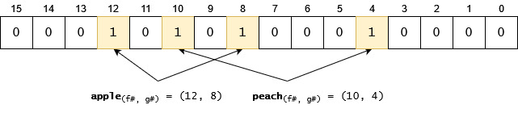
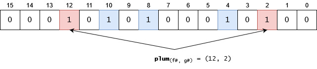

### Problem

There is a requirement to find out quickly if a given item is in a set or not. The set may be huge (terrabytes), or accessing the items may take too much time.

#### Example problem

We have a system where users are continuously registering themselves. We would like to test quickly whether their future-username is already taken or not.

### Solution: Bloom Filter

Bloom filter is the collection of a bitmap and multiple hash functions where toggling bits in the bitmaps in positions calculated by the hash functions will indicate if an item is part of the set or not with a given probability.

#### Algorithm and data structure

1. Let's assume we have a 16 bits long bitmap and 2 hash functions, **f** and **g**. The bits in the bitmap are set to **0**.

    

1. Let's insert two items: **apple** and **peach**. The **f** and **g** functions will return:
    - **( f(apple), g(apple) ) = (12, 8)**
    - **( f(peach), g(peach) ) = (10, 4)**

    We search for the indexes returned by **f** and **g** for the different items and set those bits to **1**:

    

1. Let's insert an another item, **pear**. Please note that in this case one of the hash functions will return an index which has already been set to **1**. This is not a problem in this case. (Later, we will see it may be a problem if all the indexes returned by the hash functions are already set, because that means we have found an item which was very likely been already added.):

    

1. Let's try to reintroduce an item which has already been added, **peach**. Hash functions will return the **(10, 4)** pair. If we check it, we will see that both indexes are already set to **1**. It means: the item has **very likely** been already added: 

    

1. Let's try to add a new item, **plum**, its "coordinates" will be **(12, 2)**. We can see that both of these indexes are already set to 1. That means we detected a collision, and we have to assume that **plum** has already been added. The truth is, plum isn't in the list. Possible problems:
   - The bitmap is not long enough for the number of items already added
   - Hash functions do not distribute very well
   - Too few hash functions.

    

In the end, bloom filter is a (usually huge) number. In this case our bloom filter value is 5396, which is much easier to store and handle than a list of strings.

### Usage examples

#### Help with caching(1)

Bloom filter can help with caching: if you don't want to cache something which will be accessed only once, then we can use to cache only those data which are found in our bloom filter. This way we can slow down our cache filling up.

#### Google Chrome: malicious sites (1) (2)

Chrome used bloom filters to keep users from reaching a malicious site. They have sent the bloom filter value to the clients' machines and there the URL check against this bloom filter told Chrome if the URL was in the malicious list or not.

#### Spellcheck

There are multiple solutions to this problem, most of them use some kind of search. It can be a linear search or a search in a tree graph. These algorithms may take O(n) to O(log(n)) steps to accomplish, and also will take a lot of space, since this way or the other, the word-list has to be stored.

Although if we tolerate a low probability of false positives, then we can reduce it to O(1) and drastically reduce the required space. Just use bloom filter: add all the words to the filter and after that you can check if a word is added to the bloom filter or not. As an extra, the words don't have to be stored, it is enough to have a big integer (maybe let's say ~64 kilobytes vs ~10 megabytes) to be stored. 

### Notes

- You will have to roughly know the number of items **n** you would like to store.
- You have to know the **p** maximum probability of false positives you tolerate.
- Using **n** and **p** you can calculate the number of bits and the number of hash functions to be used. See [Bloom filter calculator](https://hur.st/bloomfilter/).
- Removing is impossible since setting a bit to zero may cause other items to be removed too.
- As the number of items increase the probability of false positives are increasing. If this is too high then bloom filter should be regenerated with more bits and hash functions.

### More information & References

- [Great explanation video](https://www.youtube.com/watch?v=Bay3X9PAX5k) - Check out his other videos too! (2)
- [C# implementation](https://github.com/mattlorimor/ProbabilisticDataStructures/blob/master/ProbabilisticDataStructures/BloomFilter.cs)
- [Bloom filter calculator](https://hur.st/bloomfilter/) - Great tool and informative.
- [Bloom Filter - Wikipedia](https://en.wikipedia.org/wiki/Bloom_filter) (1)

**Cheatsheet downloadable [here](./2023_08_07_bloom-filter/bloomfilter_all_steps.pdf)**.
